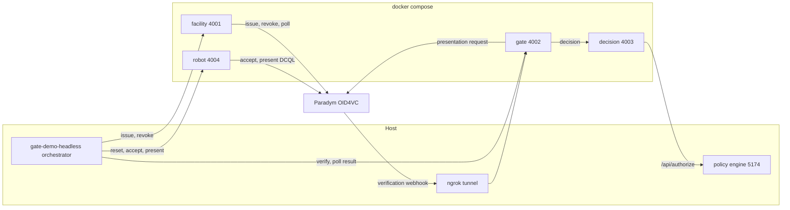
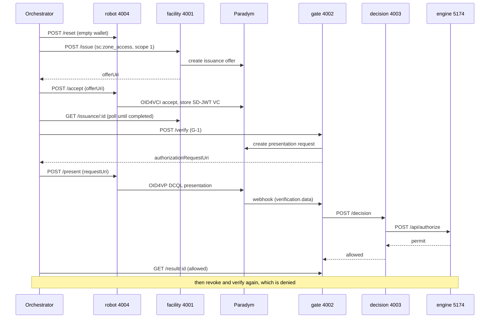

# Stormcatch Credential Core

Credential-lifecycle spine for autonomous robot gate-authorisation, built on [Paradym](https://paradym.id) (OID4VCI issuance, OID4VP verification, SD-JWT VC, status-list revocation).

A robot arrives at a gate and is allowed or denied. The whole flow runs as independent containerised services with no phone wallet: a headless [Credo](https://credo.js.org) holder receives and presents the credential over OID4VP DCQL, Paradym verifies it, and the allow/deny decision comes from the Stormcatch policy engine.

## Services

The credential backend is four containers, plus the policy engine which runs as its own service.

| Service | Port | Role | Key endpoints | API docs |
|---|---|---|---|---|
| facility | 4001 | Issuer. Issues and revokes TaskAuthorization credentials. | `POST /issue`, `GET /issuance/:id`, `POST /revoke` | `/docs` |
| gate | 4002 | Verifier (checkpoint). Starts the presentation request, receives the Paradym webhook, delegates the decision. | `POST /verify`, `GET /result/:id`, `POST /webhook` | `/docs` |
| decision | 4003 | Adapter. Turns a friendly request into the engine's full AuthorizeBody and forwards it. | `POST /decision` | `/docs` |
| robot | 4004 | Headless Credo holder. Receives and presents credentials, no phone wallet. | `POST /accept`, `POST /present`, `POST /reset` | `/docs` |
| policy engine | 5174 | RDI's `@stormcatch/authoriser`. Runs the staged pipeline (Layer 1, trust, deny, Cedar). Own repo. | `POST /api/authorize`, `/api/docs` | `/api/docs` |

Every service serves its OpenAPI document at `/openapi.json` and Swagger UI at `/docs`. `pnpm docs:check` fails if any service's routes drift from its spec.

## Architecture



## Gate-authorisation lifecycle

`pnpm gate-demo-headless` runs the whole thing with no phone wallet.



## Running it

You need a Paradym account (two wallets: one facility/issuer, one gate/verifier), the policy engine repo checked out as a sibling, ngrok, and Docker.

```bash
# 1) Configure .env (Paradym API key, facility + gate wallet ids, template ids)

# 2) Policy engine (RDI, on the host). It must bind 0.0.0.0 with a token to be
#    reachable from the decision container.
cd ../stormcatch-policy-sdk
HOST=0.0.0.0 TESTER_TOKEN=<16+ chars> pnpm --filter @stormcatch/authoriser api

# 3) The credential stack (four containers)
cd ../credential_lifecyle
docker compose up --build

# 4) Paradym verification webhook: ngrok fronts the gate, then register it
ngrok http 4002
pnpm register-webhook https://<ngrok-url>

# 5) Full lifecycle in one command
pnpm gate-demo-headless
```

Expected: verify at G-1 is `allowed`, then after revoke it is `denied`.

Individual services can also be run on the host without Docker: `pnpm facility`, `pnpm gate`, `pnpm decision`, and `pnpm robot` (from `robot-agent/`).

## Trust model

Two Paradym wallets separate the actors. The facility wallet is the issuer; the gate wallet is the verifier. The issuer identifier is a `did:web` (`did:web:metadata.paradym.id:...`), pinned on the verifier as a trusted entity that the gate's presentation template references, so the verifier only accepts credentials from that issuer.

The policy engine runs a second, independent trust check (Layer 1 plus a trust list). In the current pilot phase the decision-service sends an anchored `did:key` placeholder as the credential issuer so the engine's trust stage passes; aligning the engine's trust list to screen the real `did:web` issuer is a planned follow-up.

## Notes and gotchas

- The gate service must run with `SERVICE_ROLE=gate` (the container sets it) or it defaults to the facility wallet.
- The engine binds loopback by default and is unreachable from a container; run it with `HOST=0.0.0.0` and a `TESTER_TOKEN`, and the decision-service authenticates with that token over `host.docker.internal`.
- ngrok must point at port 4002 and the webhook must be re-registered after every ngrok restart, or the gate never receives the verification result and the request times out as a deny.
- Compose reads `.env` only when a container is created; after editing `.env` run `docker compose up -d --force-recreate <service>`.
- Presentation template ids change when templates are re-created; keep `.env` in sync (`pnpm task-setup` prints the new gate ids).

## Repository layout

- `src/services/` - the facility, gate and decision HTTP services, each with its `openapi.ts` spec.
- `src/scripts/` - setup scripts (templates, trust, webhook) and orchestrators (`gate-demo`, `gate-demo-headless`).
- `src/credentials/`, `src/templates/`, `src/dids/` - the Paradym credential, template and DID helpers.
- `robot-agent/` - the headless Credo 0.7.0 holder (its own package) exposing the robot-service.
- `docker-compose.yml`, `Dockerfile`, `robot-agent/Dockerfile` - the containerised stack.
