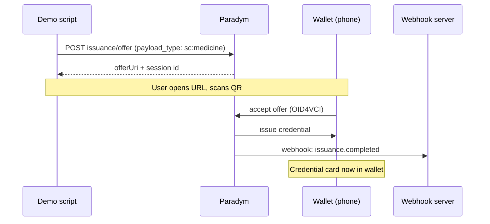
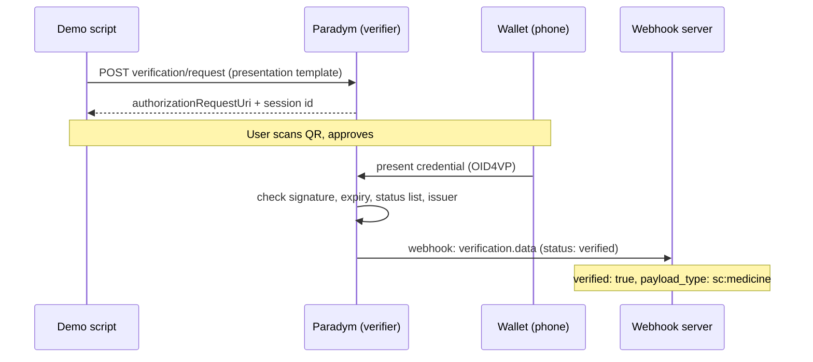
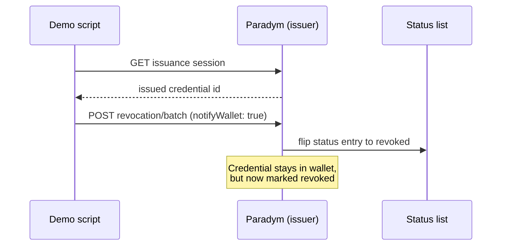
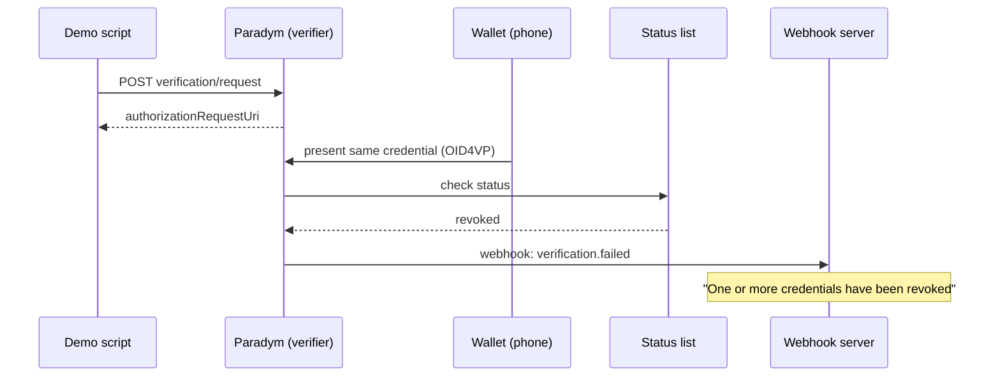
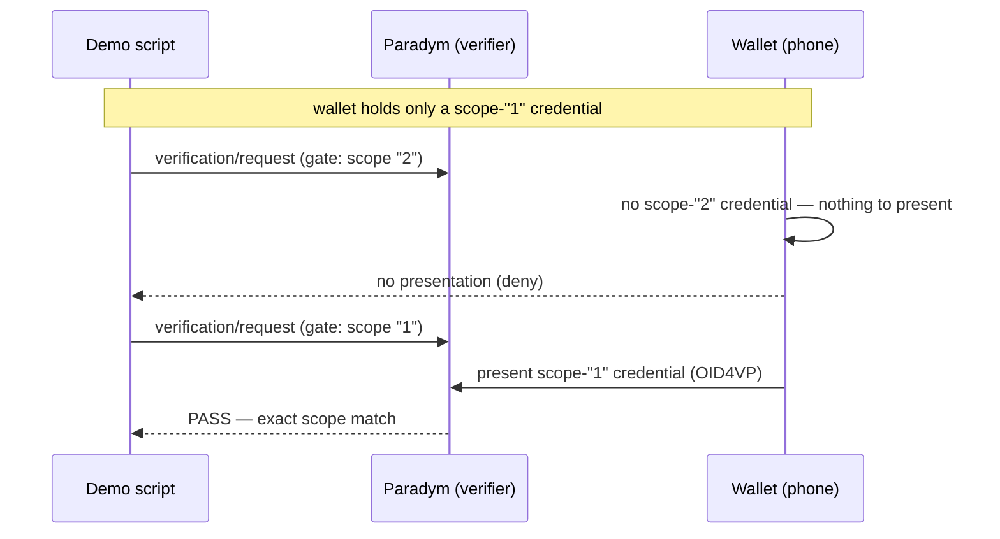

Readme · MD
# Stormcatch — Credential Lifecycle Demo
 
A working demonstration of the full verifiable-credential lifecycle built on
[Paradym](https://paradym.id): **issue → present/verify → revoke → verify (now
failing)**, plus scope-gated authorization and issuer trust.
 
Two credential types are covered, both over OpenID4VC (SD-JWT VC), with
verification results delivered back through a webhook:
 
| Credential | Attributes | Demo | Models |
|---|---|---|---|
| `PayloadCredential` | `payload_type` (string) | `pnpm demo` | Robot carries an authorized payload (`sc:medicine`) |
| `TaskAuthorizationCredential` | `action` (string), `scope` (string) | `pnpm task-demo` | Robot is authorized for an action within a facility-defined scope |
 
## Stack
 
- **Paradym** — hosted issuer + verifier (DID, credential/presentation
  templates, trusted entities, status list)
- **Paradym Wallet** — holder wallet (mobile app) that stores and presents credentials
- **Node + TypeScript scripts** — drive issuance, verification and revocation through the Paradym API
- **Express webhook server + ngrok** — receive verification results in real time
## Protocols
 
| Phase | Protocol | Paradym endpoint |
|---|---|---|
| Issue | OID4VCI | `openid4vc/issuance/offer` |
| Present / verify | OID4VP | `openid4vc/verification/request` |
| Revoke | status list (no wallet exchange) | `revocation/batch` |
 
---
 
## Lifecycle sequence diagrams
 
### 1. Issue — OID4VCI
 
The script asks Paradym to create an issuance offer. Paradym returns a URL that
renders as a QR code; the wallet scans it, completes the OID4VCI exchange, and
the credential lands in the wallet as a card. A webhook confirms completion.
 

 
### 2. Verify — OID4VP (passing)
 
The script creates a verification request from a presentation template. The
wallet scans the QR and presents the credential. Paradym checks the signature,
validity window, status list, and issuer, then delivers the result — here,
`verified` — to the webhook.
 

 
### 3. Revoke — status list
 
Revocation is a pure issuer-side operation: the script looks up the issued
credential id and flips its entry on the status list. The wallet is never
contacted — the credential stays in the wallet, but is now marked revoked. This
is what lets revocation work even when the holder (the robot) is offline.
 

 
### 4. Verify after revoke — OID4VP (failing)
 
Structurally identical to step 2 — same request, same presentation — but the
status-list check now returns `revoked`, so Paradym reports
`verification.failed`. Same credential, opposite outcome, without ever touching
the credential itself.
 

 
---
 
## Scope-gated authorization (TaskAuthorizationCredential)
 
`TaskAuthorizationCredential` carries a string `scope`. A gate is a presentation
template that requires an **exact** `scope` value (`value: "2"`). Scope is a
facility-defined string (e.g. zone `"1"`, `"2"`, `"3"`) whose meaning comes from
the `action` — it is not a numeric ladder, so a gate requiring `"2"` is not
satisfied by `"1"` or `"3"`. The same credential can therefore pass one gate and
fail another purely on the scope policy — separate from expiry or revocation.
 
The `task-demo` pipeline runs, in order (each test is set up so the wallet holds
only the credentials that test needs):
 
1. Issue a `scope: "1"` credential.
2. **Test A** — present it at a **scope-"2"** gate → **deny** (no matching
   credential in the wallet, so nothing is presented).
3. **Test B** — present it at a **scope-"1"** gate → **pass**.
4. Issue a `scope: "2"` credential.
5. **Test C** — present it at a **scope-"2"** gate → **pass**.
6. **Revoke** the `scope: "2"` credential, verify again → **deny** (revoked).
The revoke test runs last on purpose, so no earlier scope test is affected by a
revoked credential — keeping the two deny causes (no matching scope vs. revoked)
cleanly separated.
 

 
---
 
## Issuer trust (trusted entities)
 
Each gate policy requires the credential to come from an issuer the verifier
trusts. A **trusted entity** holds one or more issuer DIDs and is linked to a
credential in a presentation template via `trustedIssuers`. Once linked, only
credentials issued by a DID in that entity are accepted; an empty
`trustedIssuers` accepts **any** issuer, which is the insecure default.
 
In this demo the trusted entity holds the project's own issuer DID (playing the
role of the trusted hospital), so all issued credentials pass. The boundary only
rejects a credential whose issuer DID is not in the linked entity — i.e. a
credential minted by an untrusted issuer.
 
---
 
## Notes and findings
 
- **Scope uses exact `value` match, not `minimum`.** Paradym enforces a
  presentation template's `value` constraint but does **not** enforce `minimum`
  on a number attribute at verification. So scope is modelled as a string with
  an exact `value` match. Confirmed with an isolated run: a `scope: "1"`
  credential is denied at a `scope: "2"` gate.
- **The wallet filters by the request, so a no-match is a silent deny.** When
  the wallet holds no credential matching the request (wrong scope, wrong
  issuer), it presents **nothing** — the verifier simply never receives a
  presentation. A no-presentation timeout must therefore be treated as a
  **deny**, distinct from an explicit `verification.failed` (which is what a
  revoked credential produces).
- **Expiry is enforced wallet-side, and `validUntil` is relative to issue
  date.** Note `future` accepts `days`/`months`/`years` but not
  `minutes`/`hours`.
- **DIDs are created implicitly.** There is no create-DID API; a `did:web`
  issuer is created automatically the first time a template is created with
  `issuer: "did:web"`, and appears under Trust -> My Identifiers.

---
 
## Running the demo
 
Prerequisites: Node 20+, pnpm, a Paradym account (API key + wallet id), and ngrok.
 
One-time setup (creates templates + trusted entity, prints ids for `.env`):
 
```
pnpm template            # payload credential template
pnpm presentation-template
pnpm task-template       # task-authorization credential template
pnpm trust-setup <your did:web:...>   # trusted entity for your issuer DID
pnpm task-setup          # gate presentation templates (scope "1" / "2")
```
 
Each run:
 
1. Start ngrok: `ngrok http 3000`
2. Register the webhook to the ngrok URL:
   `pnpm register-webhook https://<your>.ngrok-free.dev`
3. Run a pipeline:
   - `pnpm demo` — payload lifecycle: issue -> verify (pass) -> revoke -> verify (fail)
   - `pnpm task-demo` — task authorization: scope-gated verify (deny/pass) + revoke
Both pipelines pause for you to scan each QR with the Paradym Wallet. Delete any
old Stormcatch cards from the wallet first, so the intended credential is the one
presented. If templates were created on an earlier day, re-create them so the
issued credentials aren't already expired.
 