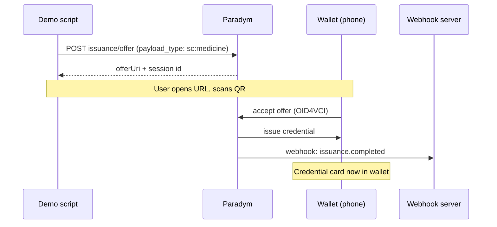
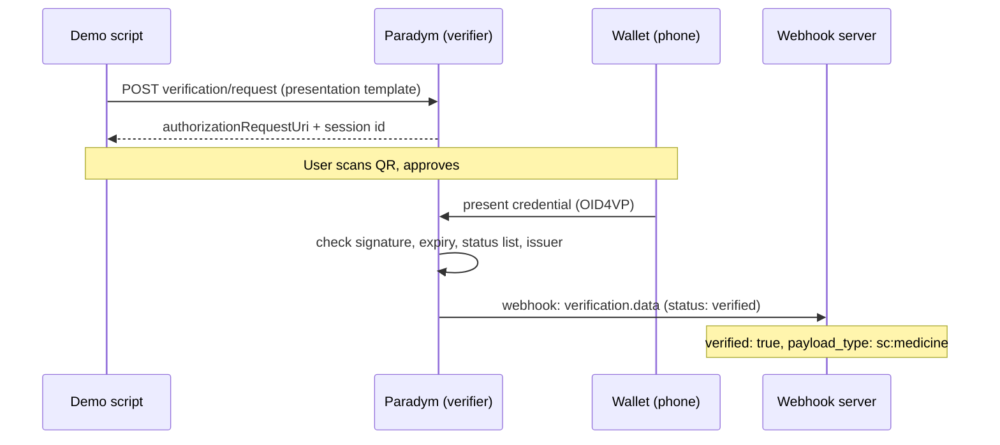
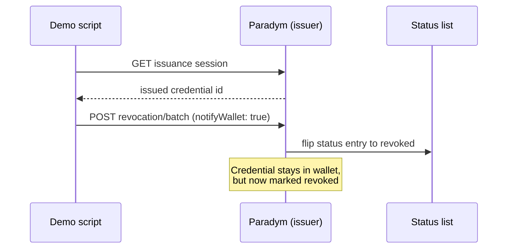
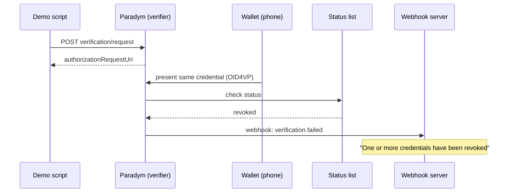
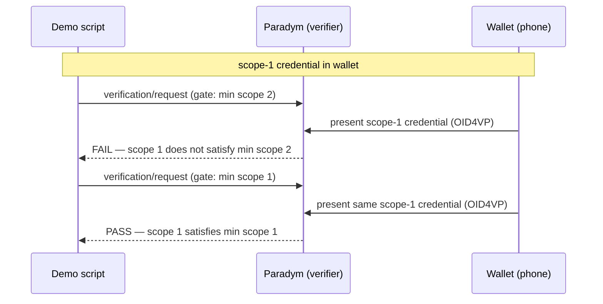

# Stormcatch — Credential Lifecycle Demo

A minimal, working demonstration of the full verifiable-credential lifecycle
built on [Paradym](https://paradym.id): **issue → present/verify → revoke →
verify (now failing)**.

The demo issues a short-lived `PayloadCredential` (proving an autonomous robot
carries an authorized payload, e.g. `payload_type: sc:medicine`), verifies it,
revokes it, and then shows the same credential failing verification — all over
OpenID4VC, with results delivered back through a webhook.

## Stack

- **Paradym** — hosted issuer + verifier (DID, credential/presentation
  templates, status list)
- **Paradym Wallet** — holder wallet (mobile app) that stores and presents the
  credential
- **Node + TypeScript scripts** — drive issuance, verification and revocation
  through the Paradym API
- **Express webhook server + ngrok** — receive verification results in real time

## Protocols

| Phase | Protocol | Paradym endpoint |
|---|---|---|
| Issue | OID4VCI | `openid4vc/issuance/offer` |
| Present / verify | OID4VP | `openid4vc/verification/request` |
| Revoke | status list (no wallet exchange) | `revocation/batch` |

---

## Lifecycle sequence diagrams

### 1. Issue — OID4VCI

The script asks Paradym to create an issuance offer. Paradym returns a URL that
renders as a QR code; the wallet scans it, completes the OID4VCI exchange, and
the credential lands in the wallet as a card. A webhook confirms completion.

### 2. Verify — OID4VP (passing)

The script creates a verification request from a presentation template. The
wallet scans the QR and presents the credential. Paradym checks the signature,
validity window, status list, and issuer, then delivers the result — here,
`verified` — to the webhook.

### 3. Revoke — status list

Revocation is a pure issuer-side operation: the script looks up the issued
credential id and flips its entry on the status list. The wallet is never
contacted — the credential stays in the wallet, but is now marked revoked. This
is what lets revocation work even when the holder (the robot) is offline.

### 4. Verify after revoke — OID4VP (failing)

Structurally identical to step 2 — same request, same presentation — but the
status-list check now returns `revoked`, so Paradym reports
`verification.failed`. Same credential, opposite outcome, without ever touching
the credential itself.

---

## Running the demo

Prerequisites: Node 20+, pnpm, a Paradym account (API key + wallet id + DID),
and ngrok.

1. Start ngrok: `ngrok http 3000`
2. Register the webhook to the ngrok URL:
   `pnpm register-webhook https://<your>.ngrok-free.dev`
3. Run the full lifecycle: `pnpm demo`

The pipeline walks through issue → verify (pass) → revoke → verify (fail),
pausing for you to scan each QR with the Paradym Wallet.

---
 
## Scope-gated authorization (TaskAuthorizationCredential)
 
`TaskAuthorizationCredential` carries a numeric `scope`. A gate is a
presentation template that requires `scope` to be at least some minimum
(`minimum: N`). Because `scope` is a number, the same credential can pass one
gate and fail another purely on the scope policy — separate from expiry or
revocation.
 
The `task-demo` pipeline runs, in order:
 
1. Issue a `scope: 2` credential, verify it at a **min-scope-2** gate → **pass**.
2. Issue a `scope: 1` credential.
3. **Test A** — present the `scope: 1` credential at the **min-scope-2** gate →
   expected **fail** (insufficient scope, nothing revoked).
4. **Test B** — present the same `scope: 1` credential at a **min-scope-1** gate
   → expected **pass** (same credential, lower gate).
5. **Revoke** the `scope: 2` credential, verify again → **fail** (revoked).
The revoke test runs last on purpose, so no earlier scope test can be affected
by a revoked credential — keeping the two failure causes (insufficient scope vs.
revoked) cleanly separated.
 

 
---
 
## Notes and findings
 
- **Expiry is enforced wallet-side.** A credential whose `validUntil` is already
  in the past is rejected by the wallet at issuance — it never reaches
  verification. So an "expired credential fails at verification" flow can't be
  shown end-to-end; the wallet blocks it earlier. The main templates still set a
  real `validUntil` (`future: { days: 1 }`); note that `future` accepts
  `days`/`months`/`years` but not `minutes`/`hours`.
- **Scope `minimum` enforcement — to confirm.** Whether the gate's
  `minimum` on `scope` is enforced by Paradym at verification (vs. only advisory)
  still needs confirming with a clean run; when presenting, make sure the
  intended credential is the one selected in the wallet.
- **Free-tier transaction limit.** Each template, issuance offer, and
  verification request counts as one transaction (Free plan caps at 100). Avoid
  re-creating presentation templates on every run — create the gate templates
  once and reuse their ids.
---
 
## Running the demo
 
Prerequisites: Node 20+, pnpm, a Paradym account (API key + wallet id + DID),
and ngrok.
 
1. Start ngrok: `ngrok http 3000`
2. Register the webhook to the ngrok URL:
   `pnpm register-webhook https://<your>.ngrok-free.dev`
3. Run a pipeline:
   - `pnpm demo` — payload lifecycle: issue → verify (pass) → revoke → verify (fail)
   - `pnpm task-demo` — task authorization: scope-gated verify + revoke
Both pipelines pause for you to scan each QR with the Paradym Wallet. Delete any
old Stormcatch cards from the wallet first, so the right credential is selected
when presenting.
 